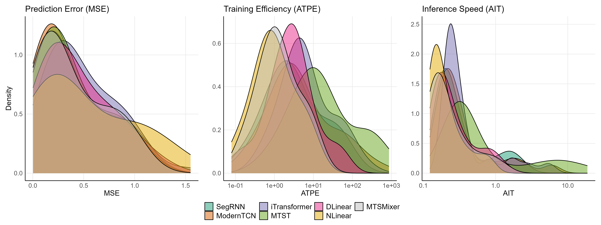
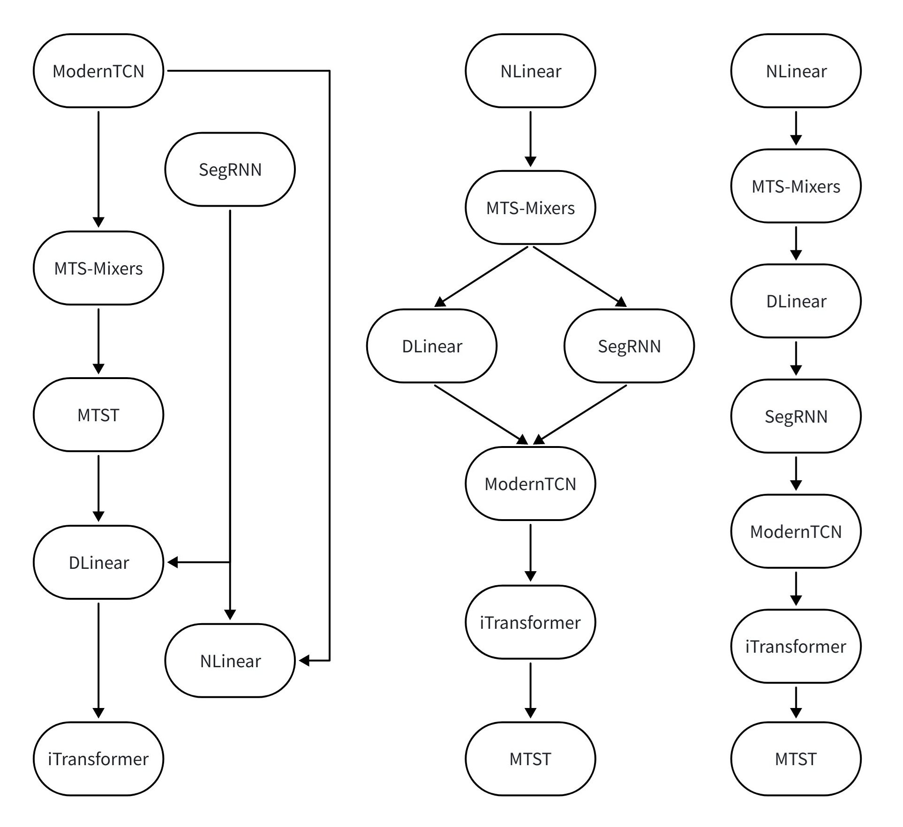
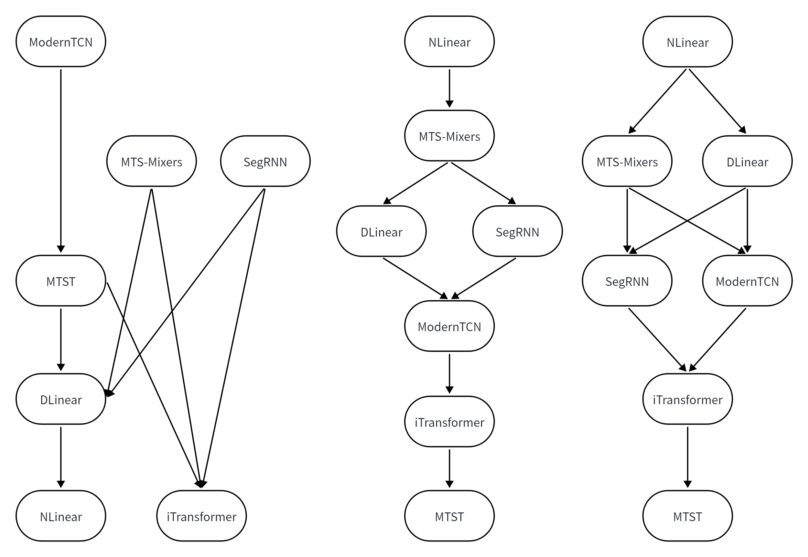
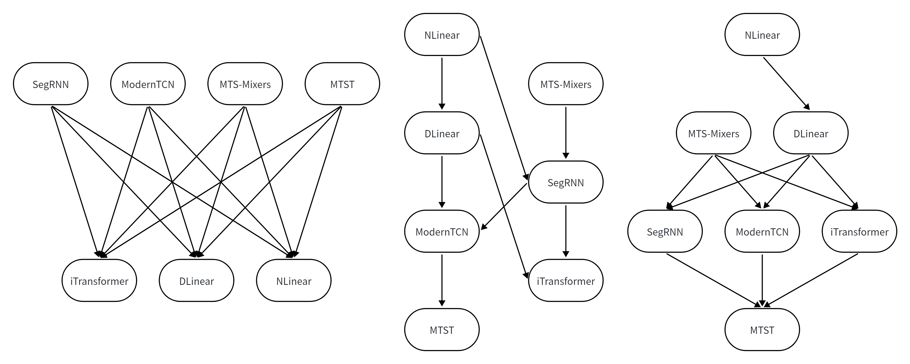

# SD Multicriteria Evaluation Framework
Welcome to the official repository of the paper: "[A Stochastic Dominance Based Multi-criteria Evaluation Framework for Time Series Forecasting Algorithms.]"

## Introduction
This algorithm comparison framework enables a comprehensive comparison of multiple algorithms across multiple quality criteria and datasets. The comparison process can be divided into the following four steps:
1. Use a multidimensional distribution function to describe the performance of algorithms across multiple quality criteria and datasets.
2. Introduce statistical measures related to stochastic dominance to evaluate the superiority between two distributions.
3. Estimate the distributions using the Density Ratio Model (DRM).
4. Perform p-value correction on the results of multiple hypothesis tests.

The above framework effectively takes into account the distributional properties of quality criteria.


## Time Series Forecast Algorithms

### Introduction

The directory "time_series_forecast_algorithms" contains the code for all the time series regression algorithms used in the paper, written in Python.

### Environment Requirements

To get started, ensure you have Conda installed on your system and follow these steps to set up the environment:

```
conda create -n Multicriteria python=3.9
conda activate Multicriteria
pip install -r requirements.txt
```

### Data Preparation

Create a separate folder named ```./dataset``` and place all the CSV files in this directory.
**Note**: Place the CSV files directly into this directory, such as "./dataset/ETTh1.csv"


## Simulation and Experiment

### Introduction

This repository also contains the complete implementation of the simulations and experiments described in the paper. The code is organized into the following directories:

- **`simulation`**: Scripts for synthetic data generation and simulation studies designed to assess the statistical power and robustness of the proposed method under controlled settings.

- **`experiment_proposed`**: Core implementation of the proposed stochastic dominance framework, including computation of the $\gamma$ index, hypothesis testing, and pairwise dominance evaluation.

- **`experiment_friedman`**: Implementation of the Friedman test with Nemenyi post-hoc analysis, used as a classical rank-based baseline for algorithm comparison.

- **`experiment_wilcoxon`**: Code for the Wilcoxon signed-rank test with Benjamini–Hochberg correction, another standard non-parametric method for pairwise algorithm comparison.

### Environment Requirements

To get started, ensure you have these R packages installed on your system:

```
install.packages(c("nnet", "MASS", "combinat", "Hmisc", "ggplot2", "patchwork", "scales", "latex2exp", "reshape2", "parallel", "readxl"))
```

## Comparison Results for Lookback L = 96 and Horizon H = 96

The figure below provides an intuitive illustration of the distribution estimates of three quality criteria — **Mean Squared Error (MSE)**, **Average Training Time Per Epoch (ATPE)**, and **Average Inference Time (AIT)** — for seven time series forecasting algorithms across 50 diverse real-world datasets.



The next set of figures compares the pairwise evaluation results from **three different statistical frameworks**, applied to the same dataset and algorithm set:

- **(Up)** Our proposed **stochastic dominance framework**
- **(Middle)** The **Wilcoxon signed-rank test** with Benjamini–Hochberg correction
- **(Down)** The **Friedman test** with Nemenyi post-hoc analysis

In each graph, an arrow `A → B` indicates that algorithm **A statistically outperforms B** on the given criterion at significance level α = 0.05.

  
*Stochastic Dominance Framework*

  
*Wilcoxon Signed-Rank Test (with BH correction)*

  
*Friedman-Nemenyi Test*

> **Key Insight**:  
> Our framework produces **significantly more decisive and informative conclusions** than traditional rank-based methods.  
> - The **Wilcoxon test** and the **Friedman-Nemenyi test** often yields **no significant differences** due to its reliance on median shifts or average rank differences, showing limited power in high-dimensional comparisons.  
> - In contrast, our method leverages **full distributional information** via the γ-index and identifies **clear directional dominance relationships** across most algorithm pairs, enabling practitioners to make confident, data-driven choices.

For cases where some comparisons remain inconclusive (e.g., between two similarly performing models), the framework can be further strengthened by:  
> - Increasing the number of benchmark datasets  
> - Incorporating user-defined weights to aggregate multiple criteria into a composite score

## Acknowledgement

We extend our heartfelt appreciation to the following GitHub repositories for providing valuable code bases and datasets:

https://github.com/yuqinie98/patchtst

https://github.com/cure-lab/LTSF-Linear

https://github.com/zhouhaoyi/Informer2020

https://github.com/thuml/Autoformer

https://github.com/MAZiqing/FEDformer

https://github.com/alipay/Pyraformer

https://github.com/ts-kim/RevIN

https://github.com/timeseriesAI/tsai

https://github.com/lss-1138/SegRNN

https://github.com/luodhhh/ModernTCN

https://github.com/plumprc/MTS-Mixers

https://github.com/networkslab/MTST

https://github.com/thuml/iTransformer
